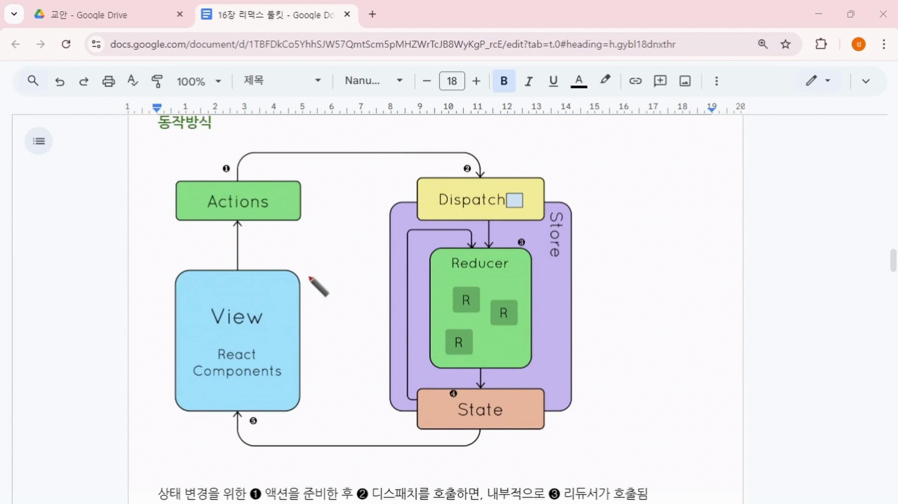

# 리덕스 툴킷의 아키텍처

## 스토어

- 애플리케이션의 상태(state)를 저장하는 핵심 공간
- 컴포넌트와는 독립적으로 존재하고, 필요한 시점에 접근하여 상태를 조회
- **configureStore()** 함수를 사용해 스토어를 간편하게 생성

## 슬라이스

- 상태와 상태 변경에 필요한 함수를 하나로 묶은 단위
- **createSlice()** 함수를 통해 만들음
- 액션 타입과 액션 생성자, reducer가 자동으로 생성됨

## 액션

- 상태 변경을 위해 필요한 정보를 담은 객체
- 값을 증가하거나, 감소하거나 리셋시키거나.. 등등의 정보
- 슬라이스에서 자동으로 만들어짐

## 리듀서(Reducer)

- 현재 상태와 액션을 받아 새로운 상태를 만드는 순수 함수
- 즉, 실제 상태를 변경하기위한 함수
- 슬라이스 내에 리듀서 함수들을 정의하여 상태 변경 로직 작성

## 디스패치(Dispatch)

- 액션을 스토어에 전달하여 리듀서를 호출하는 함수
- **useDispatch** 훅을 사용해 디스패치 함수를 쉽게 가져와 사용

## 서브스크라이브(Subscribe, 구독)

- 상태가 변경될 때마다 자동으로 컴포넌트를 다시 렌더링하기 위해 상태 변화를 감지
- **useSelector** 훅을 사용해 원하는 상탯값을 선택하고 구독할 수 있음

